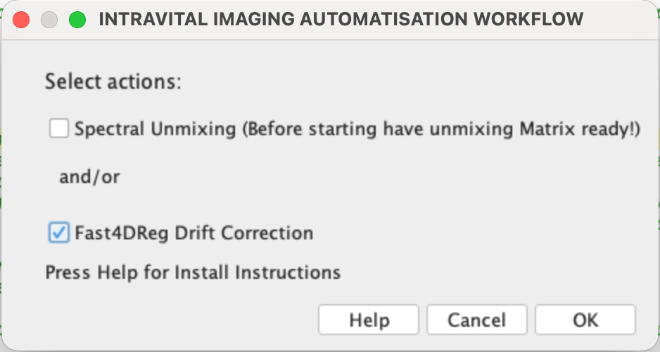
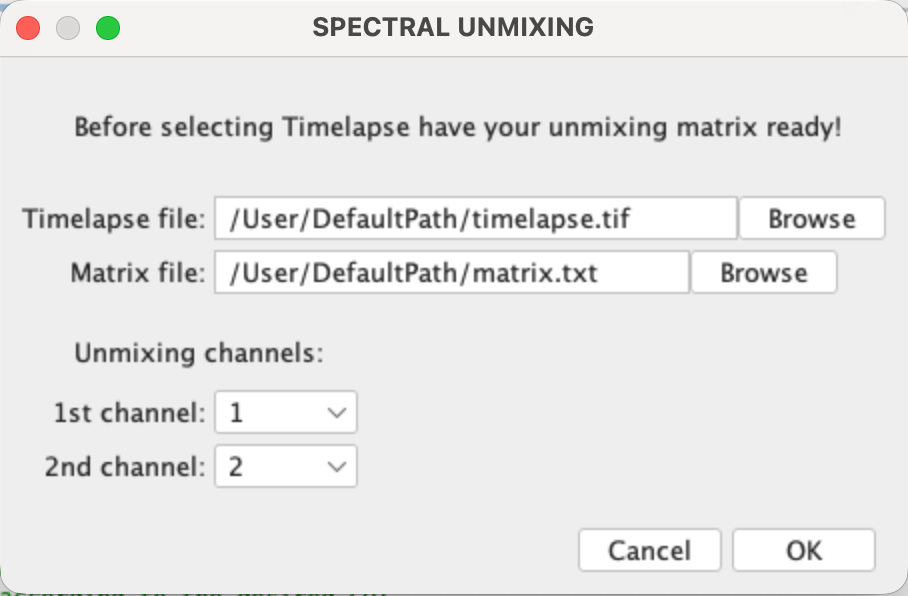
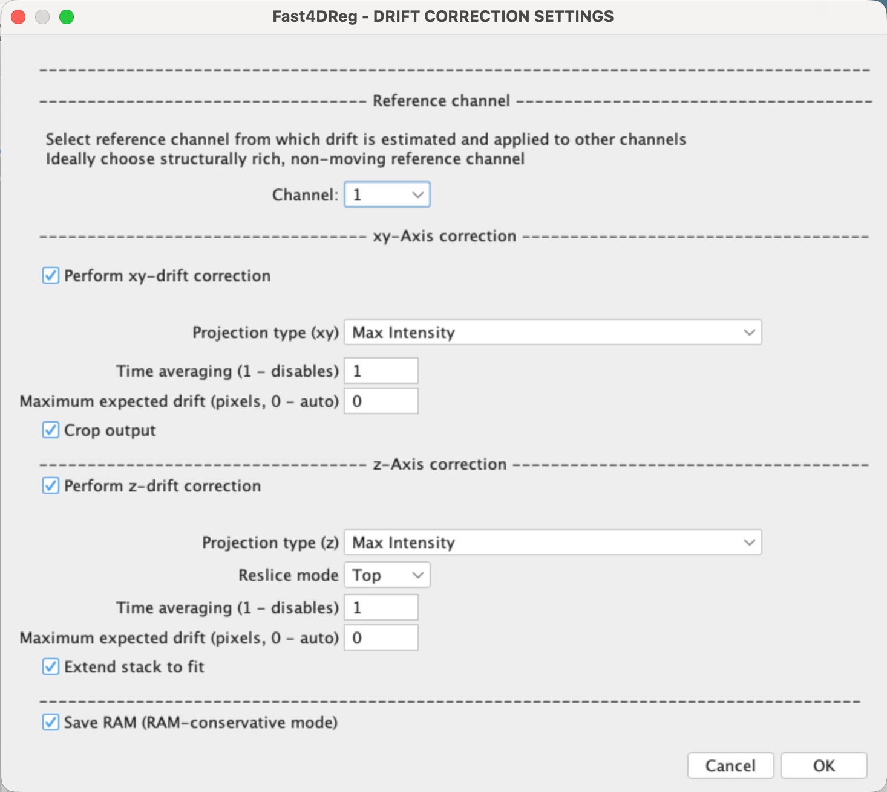

# Intravital_Imaging_Macro

## Overview
The Intravital Imaging Macro is a Fiji Macro which automates the "Spectral_Unmixing" Plugin by Joachim Walter and combines it with "Fast4DReg" by Joanna W.Pylvänäinen.

In intravital image analysis, correction for spectral bleedthrough between different colour channels and drift correction are commonly applied. To unite these two steps into one workflow I implemented the [Spectral_Unmixing](https://imagej.net/ij/plugins/spectral-unmixing.html) Plugin by Joachim Walter as well as the [Fast4DReg](https://imagej.net/plugins/fast4dreg) Plugin by Joanna W. Pylvänäinen et al. into this Macro.

## Dependencies
 - **Bio-Formats**
 - [**Spectral_Unmixing**](https://imagej.net/ij/plugins/spectral-unmixing.html)
 - [**Fast4DReg**](https://imagej.net/plugins/fast4dreg#installation)

## Walkthrough
The need for an automation was mostly apparent for the Spectral Unmixing Plugin, which if you work with long timelapses can take up a lot of time, since all timepoints have to be unmixed seperately. The Macro iterates through all timepoints of the video, seperately applying the Unmixing Matrix to each one and concatenateing them back together. 
The user is expected, before running the macro, to have the unmixing matrix already calculated. 

After the unmixing is done drift correction is performed. I implemented the code of the "time estimate+apply.ijm" Macro which is part of the Fast4DReg Plugin and which can be freely used and reproduced under a MIT license. Since the splitting of the channels has already been done there is no need to manually seperate them like when using the time "estimate+apply" on its own.

## Step-by-Step walkthrough:

### Before starting
Have unmixing matrix ready!

**Step 1:** 

Choose which of the 2 Plugins you would like to run (Either one or both).

**Step 2: Spectral Unmixing**

Add the timelapse and the matrix file. 
Choose which 2 channels you would like to unmix.

**Step 3: Fast4DReg**

The UI is a modification of the UI of the "time estimate+apply.ijm" Macro of the Fast4DReg Plugin.
